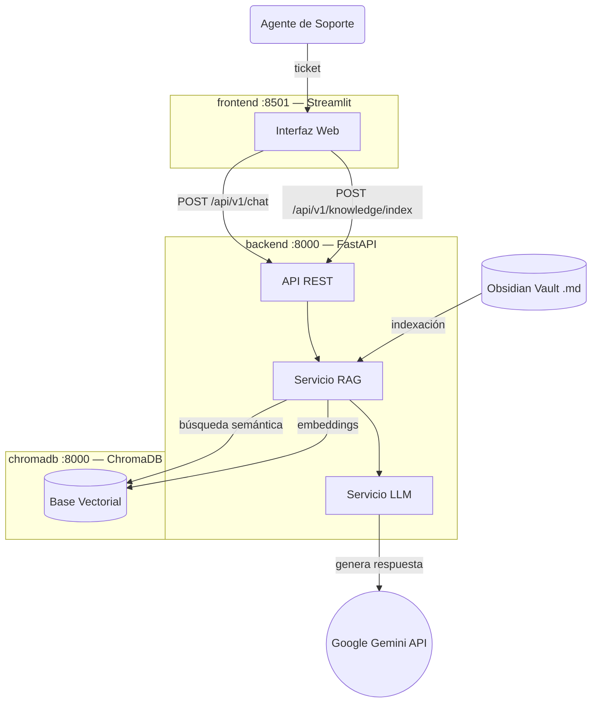

# Asistente de Soporte Inteligente (V2)

> Sistema RAG para equipos de soporte técnico que combina una base de conocimiento en Obsidian con Google Gemini para resolver tickets de forma asistida.


---

## ¿Qué hace este proyecto?

Un agente de soporte introduce un ticket en la interfaz web. El sistema busca en una base de conocimiento propia (archivos `.md` de Obsidian) documentos similares y utiliza Gemini para generar una respuesta precisa citando las fuentes relevantes.

---

## Stack tecnológico

| Componente          | Tecnología                           |
|---------------------|--------------------------------------|
| Interfaz web        | Streamlit                            |
| API Backend         | FastAPI + Uvicorn                    |
| Orquestador         | LangChain                            |
| Base de datos vectorial | ChromaDB                         |
| Embeddings          | `gemini-embedding-2`                 |
| LLM principal       | `gemini-2.0-flash`                   |
| Infraestructura     | Docker Compose (amd64 / arm64)       |
| Base de conocimiento | Obsidian Vault (`.md`)              |

---

## Arquitectura

El proyecto está dividido en tres servicios independientes:



---

## Estructura del proyecto

```
.
├── backend/                    # API FastAPI (lógica de negocio)
│   ├── main.py                 # Punto de entrada de la API
│   ├── config.py               # Configuración centralizada vía env vars
│   ├── api/
│   │   └── v1/
│   │       ├── router.py       # Agrega todas las rutas v1
│   │       ├── chat.py         # POST /api/v1/chat/
│   │       └── knowledge.py    # POST /api/v1/knowledge/index
│   ├── services/
│   │   ├── rag_service.py      # Lógica de triage + RAG
│   │   ├── llm_service.py      # Factory de LLM y embeddings (Gemini)
│   │   └── vectordb_service.py # Conexión a ChromaDB
│   ├── models/
│   │   ├── chat.py             # Schemas de request/response del chat
│   │   └── knowledge.py        # Schema de respuesta de indexación
│   ├── requirements.txt
│   └── Dockerfile
│
├── frontend/                   # Interfaz Streamlit (solo UI)
│   ├── app.py                  # Chat + sidebar, llama al backend vía HTTP
│   ├── requirements.txt
│   └── Dockerfile
│
├── obsidian_vault/             # Base de conocimiento (.md)
├── tickets_prueba/             # Tickets de ejemplo para pruebas
├── docker-compose.yml
├── .env.example
└── Readme.md
```

---

## Flujo de triage

Cuando el agente envía el **primer ticket**, el backend aplica lógica de triage:

| Ruta | Condición | Comportamiento |
|------|-----------|----------------|
| **RAG** | Similitud L2 < 0.6 | Respuesta basada en Obsidian con citación de fuentes |
| **Chat libre** | Similitud L2 ≥ 0.6 | El LLM guía al agente a través de pasos de debug |
| **Conversación** | Mensajes posteriores | Chat libre con historial completo |

---

## Inicio rápido

```bash
git clone https://github.com/<tu-usuario>/<tu-repo>.git
cd <tu-repo>
cp .env.example .env   # Añade tu GOOGLE_API_KEY
docker compose up --build
```

| Servicio   | URL                       |
|------------|---------------------------|
| Frontend   | http://localhost:8501     |
| Backend API | http://localhost:8000    |
| API Docs   | http://localhost:8000/docs|
| ChromaDB   | http://localhost:8033     |

### Primeros pasos tras el arranque

1. Abre `http://localhost:8501`
2. Haz clic en **"🔄 Indexar Obsidian Vault"** en la barra lateral
3. Escribe un ticket de soporte en el chat

---

## Variables de entorno

| Variable | Obligatoria | Por defecto | Descripción |
|----------|------------|-------------|-------------|
| `GOOGLE_API_KEY` | ✅ | — | Clave de la API de Google Gemini |
| `CHROMA_HOST` | No | `chromadb` | Host del servicio ChromaDB |
| `CHROMA_PORT` | No | `8000` | Puerto de ChromaDB |
| `SIMILARITY_THRESHOLD` | No | `0.6` | Umbral de distancia L2 para el triage |
| `LLM_MODEL` | No | `gemini-2.0-flash` | Modelo LLM a usar |
| `EMBEDDING_MODEL` | No | `models/gemini-embedding-2` | Modelo de embeddings |
| `LLM_TEMPERATURE` | No | `0.2` | Temperatura del LLM (0 = determinista) |

---

## Estado del proyecto

### ✅ Fase A — Resolución y Referencia (completada)

- [x] Docker Compose multiplataforma (`linux/amd64`, `linux/arm64`)
- [x] Arquitectura frontend / backend separados
- [x] API REST documentada (FastAPI + Swagger)
- [x] ChromaDB para búsqueda semántica
- [x] Ingesta y chunking de la base de conocimiento Obsidian
- [x] Generación de embeddings con `gemini-embedding-2`
- [x] Flujo RAG completo con citación de fuentes

### 🔜 Fase B — Extracción y Curación (próxima)

Automatizar el cierre del ciclo: que cada solución validada se convierta en un nuevo documento en la base de conocimiento.

1. **Human-in-the-Loop** — Botón "Marcar como solución" en la interfaz para validar el cierre.
2. **Limpieza asíncrona** — LLM secundario que resume la conversación.
3. **Generación de `.md`** — Creación automática del archivo en el vault de Obsidian.
4. **Estructura de metadatos** — Cada archivo generado seguirá este formato:

```yaml
---
id_ticket: #[ID]
tecnologia: [Etiquetas]
autor: [Agente_Nombre]
---
# Problema: [Resumen]
# Solución Exitosa: [Código/Pasos]
```
