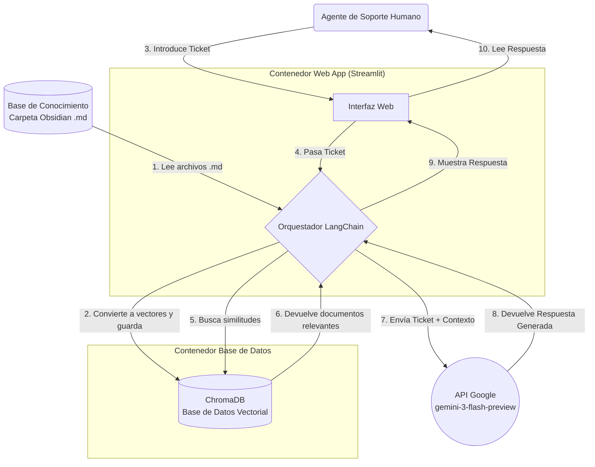

# 📚 Asistente de Soporte Inteligente (V4)

> Sistema RAG para equipos de soporte técnico que combina una base de conocimiento en Obsidian con Google Gemini para resolver tickets de forma asistida y documentar soluciones automáticamente.


---

## ¿Qué hace este proyecto?

Un agente de soporte introduce un ticket en la interfaz web. El sistema busca en una base de conocimiento propia (archivos `.md` de Obsidian) documentos similares y utiliza Gemini para generar una respuesta precisa citando las fuentes relevantes. Las soluciones validadas se documentan automáticamente, cerrando el ciclo del conocimiento.

---

## Stack tecnológico

| Componente | Tecnología |
|---|---|
| Interfaz web | Streamlit |
| Orquestador | LangChain |
| Base de datos vectorial | ChromaDB |
| Embeddings | `gemini-embedding-2` |
| LLM principal | `gemini-3-flash-preview` |
| Infraestructura | Docker (amd64 / arm64) |
| Base de conocimiento | Obsidian Vault (`.md`) |

---

## Arquitectura



---

## Estado del proyecto

### ✅ Fase A — Resolución y Referencia (completada)

- [x] Docker Compose multiplataforma (`linux/amd64`, `linux/arm64`)
- [x] ChromaDB para búsqueda semántica
- [x] Ingesta y chunking de la base de conocimiento Obsidian
- [x] Generación de embeddings con `gemini-embedding-2`
- [x] Flujo RAG completo con citación de fuentes

### 🔜 Fase B — Extracción y Curación (próxima)

Automatizar el cierre del ciclo: que cada solución validada se convierta en un nuevo documento en la base de conocimiento.

1. **Human-in-the-Loop** — Botón "Marcar como solución" en la interfaz para que el agente valide el cierre.
2. **Limpieza asíncrona** — LLM secundario que resume la conversación y elimina los intentos fallidos.
3. **Generación de `.md`** — Extracción automática de la solución y creación del archivo en la carpeta de Obsidian.
4. **Estructura de metadatos** — Cada archivo generado seguirá este formato:

```yaml
---
id_ticket: #[ID]
tecnologia: [Etiquetas]
autor: [Agente_Nombre]
---
# Problema: [Resumen]
# Solución Exitosa: [Código/Pasos]
```

---

## Inicio rápido

```bash
git clone https://github.com/<tu-usuario>/<tu-repo>.git
cd <tu-repo>
cp .env.example .env   # añade tu GOOGLE_API_KEY
docker compose up --build
```

Accede a la interfaz en `http://localhost:8501`.

